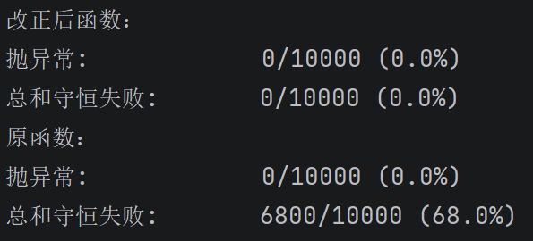

# 奖池分账正确实现报告

## 规则
分配结果必须满足：所有人拿到的金额之和，等于池子总额。

## 背景
```text
pool_split.py —— 每日瓜分奖池的分账逻辑

这是我们线上「每日瓜分奖池」的真实代码，为这道题做了简化
（去掉了数据库读写和日期处理，只留下算钱的部分）。

背景：
  平台每天放一个奖池。当天达标的用户，按各自的贡献权重瓜分池子里的钱。

约定：
  · 所有金额都是整数「分」，系统里不存在半分钱。
  · weights 是每个人的贡献权重（线上用的是「合格采集秒数」）。

硬规则（产品定的，不能破）：
  分完之后，所有人拿到的钱加起来必须【正好等于】池子总额。
  多一分 = 平台凭空多发了钱。
  少一分 = 有人的钱卡在系统里没发出去。
```
此处假定「合格采集秒数」、奖池总额应当为非负数，故后续不考虑权重为负的情况。
## 1.错误所在
原函数如下
```python
    def split_pool(pool_cents: int, weights: list[int]) -> list[int]:
        total = sum(weights)
        return [round(pool_cents * w / total) for w in weights]
```

### 1.1 个人所发现的错误
不难发现，原来的方法是通过加权平均分的方式去分配奖金，那么一旦奖金池中奖金不被权数和整除，那么得到的结果经过 round 后，最后之和大概率（有概率
每个人四舍五入产生的误差，正负加起来必须刚好为 0。e.g. pool_cents = 1004, weights = [1,2,3,4], 此时得到 result = [100,201,301,402]
sum(result) = pool_cents）不会与原奖金池奖金相等。 
 
以及没有做 sum(weights) = 0 / weights = [] 的保护性措施

### 1.2 AI发现的错误
大数精度丢失：pool_cents * w / total 产生 float。当乘积超过 2⁵³（约 9×10¹⁵）时 int→float 转换丢精度，round 结果可能差好几块钱。
(个人认为不一定是真实货币，可能是虚拟币，所以需要考虑；已考虑池子总额为 0，可以正常返回全 0 数组)

## 2. 修改 split_pool
搜索发现最大余数法，可以解决这个问题

算法思想如下：
* 首先按比例计算每个项目的理论分配值
* 给每个项目分配其理论值的整数部分
* 将剩余的名额按照小数部分的大小顺序分配

运用这个方法的同时我们还要考虑到：1.人民币（暂且认为是吧）的最低单位是分，所以能到 0.01 级；2.大数情况

具体实现：
```python
    def split_pool_corrected(pool_cents: int, weights: list[int]) -> list[int]:
    # 保护
    if not weights or sum(weights) == 0:
        return []

    total = sum(weights)
    # divmod 一次拿到 商 和 余数，避免浮点
    parts = [divmod(pool_cents * w * 100, total) for w in weights] # 直接转换成”分“，分的更细更公平
    result = [q for q, _ in parts]

    diff = pool_cents * 100 - sum(result)  # 还没分出去的"分"
    order = sorted(range(len(weights)), key = lambda i: (-parts[i][1], i)) # 按照余数排序来分剩余的”分“
    for i in order[:diff]:
        result[i] += 1
    return [Decimal(f"{v // 100}.{v % 100:02d}") for v in result] # 防止再引入浮点数
```

## 3. 测试
脚本在test_pool_split.py

测试结果截图：



## 4. AI 的使用情况

### 4.1 提问有无忽略错误
AI帮助我发现了大数情况下浮点数的丢失精度问题
- [x] 采用

### 4.2 帮助生成更正的函数
AI大体框架正确，但是没有考虑到人民币最低单位是”分“的情况，于是根据这个自己修正。
- [乄] 采用（一半）

### 4.3 帮助生成批量生成测试样例的脚本
AI基本考虑了所有情况，但未考虑保护性措施，所以自己增添该审查。
- [x] 采用

## 5 问题回答

### 5.1 测试覆盖了多少组输入？有没有比手写若干样例更不容易漏掉问题的写法？
10000组；用生成脚本批量生成

### 5.2 修改后，多出或缺少的那几分钱分配给了谁？依据是什么？换一个人是否可行？
按照余数大小顺序依次分配；如果余数相同，换人是可行的。

### 5.3 这段代码是否还有其他会出错的输入？
按目前的测试脚本来看，没有了，但是不排除脚本未覆盖到的情况，所以先存疑。

